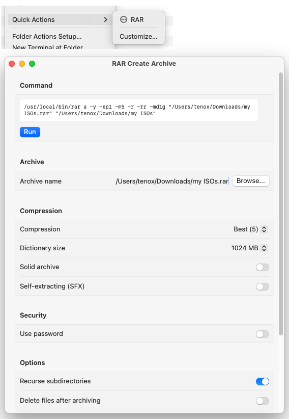

# RARExt

macOS Finder Quick Actions Extension for creating and extracting [RAR](https://www.rarlab.com/) archives.

It executes `rar` binary from `/usr/local/bin` to process archives.

## Installation

- Download and place [RAR binary](https://www.rarlab.com/download.htm) in `/usr/local/bin`
- Download and run `RARExt.pkg`
- Open and close `RARExt.app` from /Applications once
- Go to `System Settings > General -> Login Items & Extensions > Finder` enable RAR extension

## Usage

Select files/folders in Finder → Right-click → Quick Actions → RAR

## Illegal

Hallucinated entirely by a robot named Claude.

Humans are prohibited from downloading, copying and using this software.
